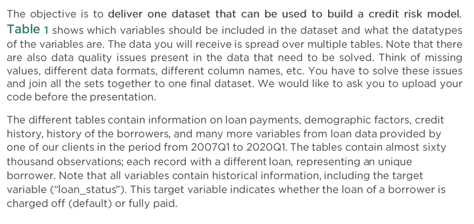
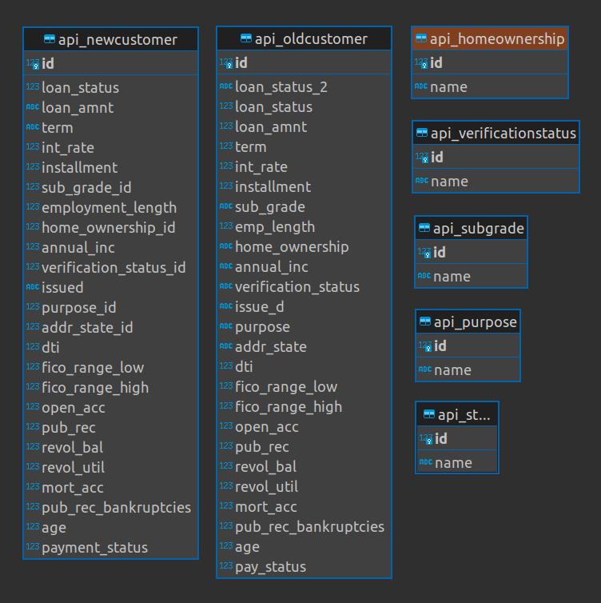
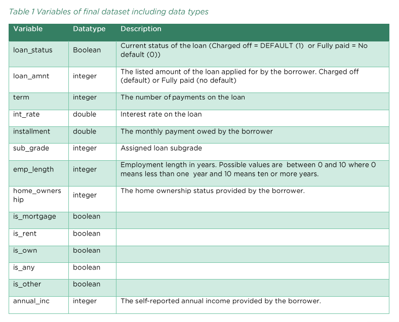
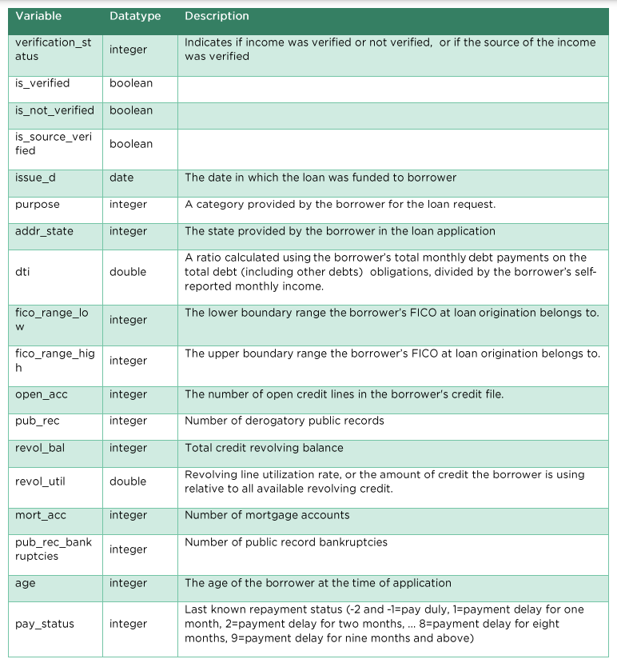
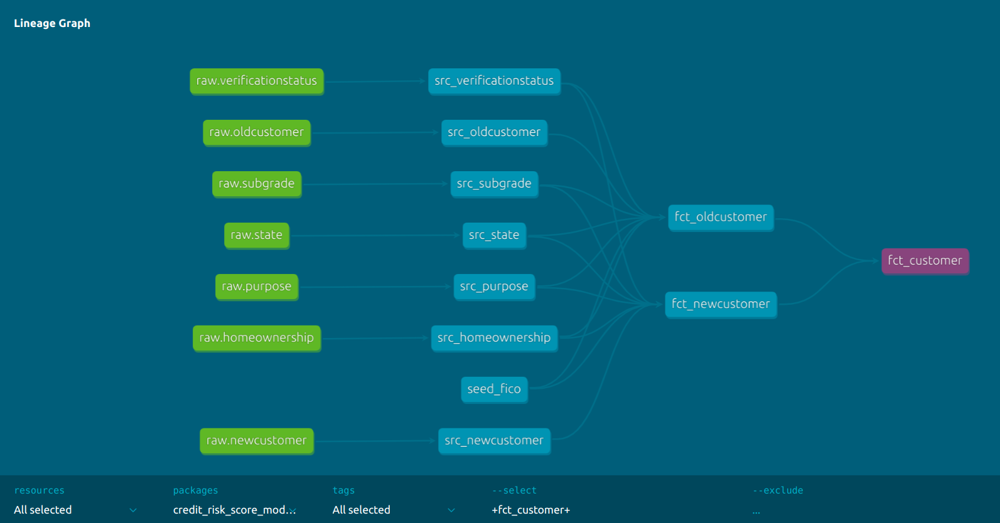

# Credit Risk Score Modelling
Designed, implemented, tested, packaged and submitted by [**Alin Preda**](https://www.linkedin.com/in/alin-preda/), Copenhagen, Denmark, August 2023. 

##  Task Description
I have included the task's instructions here as a screenshot (couldn't select and copy original text):


Essentially, we are to take the following raw data with its customer loans facts and its other dimensions, as presented in this diagram and transform it into a final schema.



The final schema should have strict data types, naming conventions, and should consider missing values, acceptable ranges, etc.





## Methodology

### Choice of Tech Stack

<b>Why not Sqlite?</b>

The data was provided as an Sqlite3 database file. Initially, I started coding with DBT over Sqlite but quickly found myself concerned with the fact that Sqlite3 does not support certain data types such as boolean. It recognizes TRUE and FALSE but internally it converts them to 1s and 0s. 

Secondly, while trying to clean the dates field, I found out it does not natively support REGEXP. What a bummer! I had to install a [Perl regular expressions package](https://stackoverflow.com/questions/5071601/how-do-i-use-regex-in-a-sqlite-query) which had to be loaded from the command line (or with a SELECT load_extension() statement) every time I wanted to use it. 

Thirdly, Sqlite does not allow views in one schema (i.e. database file) to reference objects in another schema. You'll get this error from SQLite: "view [someview] cannot reference objects in database [somedatabase]". You must set materialized='table' in models that reference other schemas.

Lastly, there is an [issue](https://github.com/codeforkjeff/dbt-sqlite/issues/47) with the Sqlite adapter for DBT, where I also commented. You can edit the code in your virtual environment, like I did, to apply a bugfix. If you don't do this, you can't use the adapter, hence, you cannot even compile, much less run your models.

All of this was a bit too much for me to handle...


Hence, I decided to migrate the Sqlite database to a data warehouse in the cloud. I first used [Dbeaver](https://dbeaver.io/) to export the raw tables as CSV files. Then, I imported the flat files into my data warehouse, with schema generated on read.

<b>Why BigQuery?</b>

Why not BigQuery? Personally, I am most experienced with this EDWH solution so please excuse my bias, but it's actually pretty great. I think it's especially good for these types of small scale projects because it's very easy to sign up for Google Cloud and get a warehouse up and running. It has a very generous free tier and I personally run several daily jobs on it with literally zero costs. BigQuery has a lot of support, it boasts many modern analytical functions, it has partitioning and clustering, it has [BI Engine](https://cloud.google.com/bigquery/docs/bi-engine-intro) for real-time Business Intelligence, it's serverless, pay-as-you go, and has a good graphical interface. 

My second choice would have been Snowflake since it's also an amazing DWH provider. Actually, both of them work with the unofficial [Great Expectations package for DBT](https://github.com/calogica/dbt-expectations) which is amazing for testing. And I believe the SQL we use in this project can be seamlessly applied to Snowflake as well (correct me if I am wrong). The only requirement is that you install the proper dbt-snowflake adaptor and that you provide the correct information the profiles configuration.

In general, using an enterprise data warehouse is the way to go. The compute and storage are separated, there is security, you have modern functionality, infinite scalability, high availability, low latency, and much more. 

<b>Why DBT?</b>

Having just recently got certified with [DBT](https://www.getdbt.com/) <i>(disclaimer: on Udemy)</i>, I was very excited to apply it to such a task. And boy, oh, boy, is it amazing to use. After using DBT I don't think I could go back to Python or just plain SQL scripts for these types of use cases. DBT core (the open sources, free version including Python package and Command Line Tool) empowers Data Engineers and Analytics Engineers to bring software engineering best practices into their data modelling and ELT tasks:
- Frees up time of developers and invites them to collaborate.
- Fits perfectly with source control, versioning and CI/CD.
- Enables extremely powerful and thorough automated testing - more control over your models.
- It's modular and highly customizable with macros. 
- It has a low barrier to entry and smooth learning curve.
- Uses the powerful Jinja templating language to make SQL more dynamic.
- Creates automatic and dynamic documentation for your data model, including data lineage.

<b>Why not Python?</b>

For such a simple transformation pipeline, I didn't even consider going through the complexities of using a programming language. By using SQL, a declarative language, we can write business logic faster and make it more accessible and easier to comprehend or to be on-boarded. Furthermore, by choosing to use a DWH, instead of performing ETL, it's more straightforward to perform ELT. DWH are powerful and can handle big data volumes, in case we need to scale up (which we should, in production).

## The Data
I provide you with both the Sqlite3 database and the CSV files I have exported. You will find them under <i>./data</i> in their respective directories. If you want to follow along with the assignment, create your tables in the cloud data warehouse of your choice by uploading the CSV files.


## How to Run the Code from Scratch
<b>Virtual Environment</b>

DBT is a Python package available through pip. It is standard practice to use a virtual environment for different projects. My choice is to use [Pipenv](https://pipenv.pypa.io/en/latest/), a tool that combines <i>virtualenv</i> with <i>pip</i>. Yours could be virtualenv or even Poetry. So I provided you with <i>Pipfile</i>, <i>Pipfile.lock</i> and also good old <i>requirements.txt</i>, to suit your own developer preference and be able to install the dependencies.

<b>Dependency Management</b>

- Make sure you are in the main directory (cd into it, if you've git cloned it) and set up your virtual environment. 
- Then you can either ```pip install -r requirements.txt``` or if using Pipenv you can ```pipenv shell``` to start the interactive shell and then ```pipenv install```. This will install the DBT database connectors (for sqlite and bigquery). 
- Following this step, you will want to also install some DBT packages (dbt_utils and dbt_expectations) which are defined in <i>packages.yml</i>. Do this by running ```dbt deps```.

<b>Connecting to BigQuery</b>

DBT provides an [official guide](https://docs.getdbt.com/quickstarts/bigquery?step=4) of how to set up the connection. But I will explain in simpler terms:
- First, you need a GCP account, of course.
- Then you need to have or create a project.
- Enable the BigQuery API if not already available.
- Create a service account using IAM and grant it a BigQuey role that can allow you to run the models.
- Go to the service account's page under keys and download one JSON file. Ideally, name it <i>'service_account_key.json'</i> and put it in the same folder as your <i>profiles.yml</i>.

I have already handled the back-end of connecting for you, provided you have this keyfile, and the name of your GCP project. That is because in the profiles configuration file we need the path to the keyfile and the name of the project. But, I have used Jinja to reference two environment variables: GCP_PROJECT_ID and DBT_SERVICE_ACCOUNT_KEYFILE. Why? Because I you **not supposed to share your keyfile**. It can be used by bad agents to impersonate a legitimate service account. Imagine a hacker getting hold of this file and you gave BigQuery Admin rights to your DBT service account. Talk about scary!

Now, setting up environment variables manually is a pain, which is why I offer you a much simpler way out. Simply cd into the folder where <i>setup_env_variables.sh</i> is and run the command declare environment variables: ``` source setup_env_variables.sh --gcp-project-id "<your_own_project_id>" --dbt-service-account-keyfile "<path_to_your_keyfile"```. You can also just run ``` source setup_env_variables.sh``` to set them to default values, which you can yourself change in the script. There are also two environment variables for connecting to Sqlite3, but we will skip that as we are not actually using it.

<b>Testing DBT connection to DWH</b>

Now, if everything is correct, you should be able to test your connection to the data warehouse and also the correctness of your DBT project's code by running ```dbt debug```. Check the output and I pray you see only green and no red colors.

## Modelling and ELT Pipeline
DBT <i>models</i> are created as SQL select statements. They can be materialized in different ways in our warehouse, including views and tables. You will find these under <i>credit-risk-score-modelling/models/</i>.


<b>Source Models (views)</b>

I want to create some views of the raw tables as sources for my models, using CTE (Common table expressions). The reason is such that we can document them within DBT, and able to use them in generating docs DAG. If we just built the rest of the models directly on the raw tables, then we wouldn't be able to trace data lineage back to them. You will find these under <i>credit-risk-score-modelling/models/src</i>.

<b>Fact Models (views, table)</b>

Due to the two conflicting customer fact tables, which require in some cases completely different types of cleaning and data manipulation, I have decided that the best way to complete the final table is to divide and conquer. I have modularized the code and the model, such that I have two views, <i>fct_oldcustomer</i> and <i>fct_newcustomer</i> in which I apply different transformations and for which I have pretty much the same set of tests implemented. The final table is simply a UNION ALL between the two views.

<b>Compiling and Materializing Models</b>

DBT code will be compiled to SQL code native to the choice of data warehouse. Running ```dbt compile``` will do this and it will put the compiled code into <i>credit-risk-score-modelling/target/compiled</i>. But it will not materialize the models yet. To do that, you need to run ```dbt run```. This will compile SQL code including actual materialization, and you can check it (mostly for debugging) in <i>credit-risk-score-modelling/target/compiled</i>. You can run this code directly against your warehouse and it will just work. To run a specific model, compilation or test, use the ```dbt --select``` flag followed by the name (the filename) of your model.

> Obs: if you want to run all models completely from scratch, run ```dbt run --full-refresh```. If you want to clean up your project, the command ```dbt clean``` will erase the <i>target</i> and <i>dbt_packages</i> folders by default. In my case, I also added the logs to be cleaned. This can be changed in <i>dbt_project.yml</i>.

<b>Testing</b>

The fact models are being thoroughly tested on a general level and on column level. I am checking that data types are what we expect, that unique columns are indeed unique, that we don't lose records in the process, that we don't have nulls, and values are within specified ranges or sets of values, while also triggering warnings on outliers which don't break our pipeline at runtime. The tests are defined in the <i>sources.yml</i> file and they use native DBT and much of the Great Expectations package. 

In order to perform the entire suite of tests on the models and check everything is okay, simply run ```dbt test``` from the command line. **Fingers crossed!**


## Documentation WebServer
DBT allows us to generate dynamic documentation on our models. Run the command ```dbt docs generate``` and it will create a 'catalog' which is a JSON file. Running ```dbt docs serve``` will serve us a DBT Documentation web application on http://localhost:8080. To shutdown the server, press Ctrl+C in your command line.

I **highly recommend** to make use of this feature of DBT and explore its full capabilities. The documentation application is extremely detailed and it gives you full information on your models and your data including statistics, data size, descriptions of datasets and their columns, which tests we are running, data types, and even a fully interactive representation of a data lineage DAG (Directed Acyclic Graph) of your DBT models:



## Comments on Data Quality
I have gathered the following observations on the datasets.
- **loan_status** boolean: in both fact tables is integer; check not null.
- **loan_amnt** integer: in new_customer it's like <i>12.0k</i> format string; in old_customer it's already an integer like 12000. 
- **term** integer: new_customer is like <i>3.0Y</i> format string; old_customer is integer already; check not null, consider meaning of zero.
- **int_rate** double: here already some floating point number in both, check if not null.
- **installment** double: looks fine in both, check non zero, not null.
- **sub_grade** integer: you have sub_grade_id integer in new_customer, and sub_grade in old_customer which is the code, we actually need the integer; heck that codes and numbers exist in the table; check not null.
- **emp_length** integer: employment_length in new, good in old, replace nulls with zero, check not null, should be >= 0.
- **home_ownership** integer: old customer has in string, new has in integer called home_ownership_id, check values in table.
- **is_mortgage** boolean: I just want to say that including this in the credit risk model alongside the following features is redundant.
- **annual_inc** integer: here we need to break down in old_customer in two numbers, take the middle point and replace; check not null. 
- **verification_status** integer: in old_customer it's a string, in new_customer it's a number; we've seen this before.
- **is_verified boolean**: if source verified or verified => true else false;
- **is_not_verified** boolean: same thing but inverse.
- **is_source_verified** boolean: see above.
- **issue_d** date:  in new_customer called issued; contains YYYY-mm, YYYY-mm-dd, dd-MON-YY, timestamps, etc,; in old_customer called issue_d; seems to contain only timestamps at 00:00:00; must bring them to common format YYYY-mm-dd; check if string of date corresponds to this regex.
- **purpose** integer: new_customer has purpose_id; old_customer has name; check if integers are in ids; check if strings are in names in dim tables.
- **addr_state** integer: same as above.
- **dti** double: just check if between 0.0 and 100.0. I would suggest using numbers from 0 to 1 for ratios.
- **fico_range_low** integer: low in both tables is 660 and high is 664, very interesting, they in reality go from 300 to 850; must replace missing values with some defaults.
- **fico_range_high** integer: same as above.
- **open_acc** integer: replace nulls with 0, must be positive.
- **pub_rec** integer: same as open_acc.
- **revol_bal** integer: same as open_acc.
- **revol_util** double: replace nulls with zero, should be between 0.0 and 100.0.
- **mort_acc** integer: same as open_acc.
- **pub_rec_bankruptcies**: same as open_acc.
- **age integer** integer: should be between 18 to a bit over 100; doesn't contain nulls but check not null still.
- **pay_status** integer: must check that it's within accepted set of values.


## Curiosities and Observations
<b>State Variable</b>

My most concerning finding is with respect to the <i>addr_state_id</i> variable in <i>api_newcustomer</i>. I notice that for the <i>api_state table</i> and both the customer tables we have 51 distinct values for names of states and ids respectively. And yes, in <i>api_state</i>, the ids go from 51 to 102, and they correspond correctly with their names to values of <i>addr_state</i> in <i>api_oldcustomer</i>. But the problem is that the <i>addr_state_id</i> values range from 1 to 51. From this I have devised two very different hypotheses.
- The 1-51 values represent completely different states, outside of the US (unlikely, since they are 51 in number which is the total number of US states plus Washington DC).
- They represent the same states so I just need to work around the numbers and either keep a range of 1 to 51, or a range of 52 to 102.
For the time being, I have chosen to add 1 to the <i>addr_state_id</i> variable in <i>fct_newcustomer</i>, such that I can keep consistency with the dimension table.


<b>Loan Amount Variable</b>

What is it with the negative value loan amounts? Is that possible, financially speaking? If that is not correct, then I see two probable solutions:
- The number should be set to positive (eg. -12000 becomes 12000).
- The number should be set to zero (less probable).
In case it is actually correct, I can simply keep the number as is because it makes some business sense (which is the working solution).

<b>Annual Income Variable</b>

It was interesting to find ranges for <i>annual_inc</i> in the <i>api_oldcustomer</i> dataset. Unfortunately, this means we cannot fully reconcile the two datasets on this variable since the other one is offering nominal values. This would end up messing up with the accuracy of the classifier downstream, but data in the real world is often messy, which means we need to find a solution of compromise.

My take was to get the average between the low and high end of the intervals. Initially I added 1 to the lower interval because it is exclusive, but I prefer nice and round numbers. 1 currency denomination should not mean anything. Please correct me if my logic was wrong.

<b>Fico Ranges</b>

I have learned from this assignment that FICO ranges between 300 to 850, so my tests for expected values reflect that. I have also amused myself at discovering that this sample dataset covers scores above the 'poor' threshold. Both the old and new customers onyl go between 660 and 845 which must have been the filter criterion for creating this dataset. Am I on to something? Anyway, it must be a **lucky bank**. :D 

Back to the point, I decided that for some ML models downstream (except for trees), NULL values are not acceptable and that I would like to replace the NULLs with some values. My current logic was to take the average between the min/max low and high FICO ranges and put them in a [**seeds**](https://docs.getdbt.com/docs/build/seeds) (DBT concept) CSV file, from which I created a seeds table. I use these values to fill in the NULLS. I see it as an acceptable practice because we can version control it and change it easily so we can even backpropagate changes within our warehouse.

> <b>Obs:<b> Actually, when fico_range_low is missing, fico_range_high is present and vice-versa so we can safely assume that missing values are a symptom of the FICO ranges being equal. This will become the final workaround.

<b>Machine Learning Feature Selection</b>

I have noticed several redundancies in this supposed ML training dataset: 
- We have included both <i>is_verified</i> and <i>is_not_verified</i>. Having just one in the model conveys the entire information. It is not necessary to include both, and one should be kept and the other removed. Semantically, the first one makes the most sense for human readability.
- We have included both the numerically encoded categorical variable <i>homeownership</i> and the 1-hot encoded values such as <i>is_mortgage</i>, etc.
- Is pay status supposed to also have values of zero? Because in the PDF of the assignment I have received it says in the variable's description field that "-2 and -1 represent 'pay duly' and then from 1 onwards to 9 the values represent payment delay.' As such, I am assuming that zero also means 'pay duly' or paid just in time, whereas negative values mean that the loan was paid before the term. Is that correct? Currently, I disabled the DBT tests which check for the expression 'pay_status != 0' until I come to the bottom of this.
- For the home ownership variable I also noticed we have a <i>name</i> of 'NONE' in the dimension table. I thought of assigning Nones to <i>is_other</i> as it made the most sense to me at the moment. But then it's also not clear what the distinction between **ANY** and **OTHER** is, so please explain this further.
- Lastly, I believe the ID should still be included in this dataset, and should be discarded downstream by the ML pipeline if needed. But it is still very useful for analysis and debugging purposes, and of course, very much so for inference, because we are very interested in who is the customer who might default on their credit.
- I also noticed due to the DBT tests, that the final table's IDs are not actually unique which means that we have captured information on the same customers in the two tables. Either this, or we need new **truly unique** IDs.
