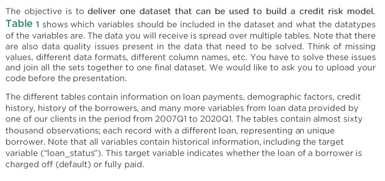
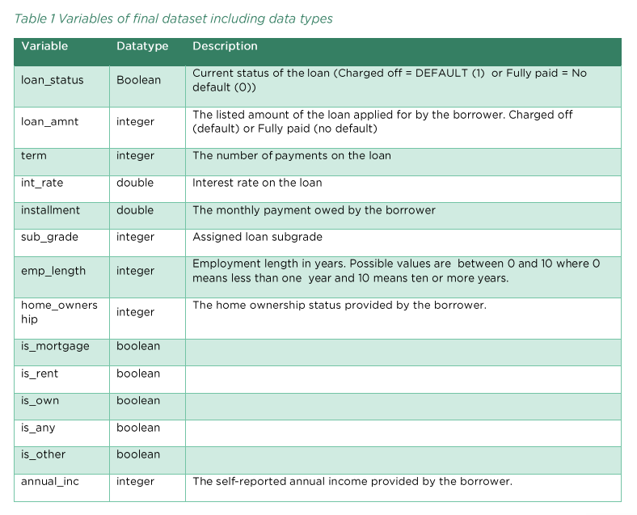
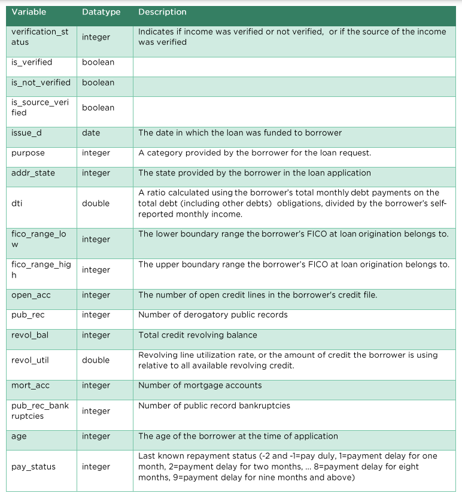
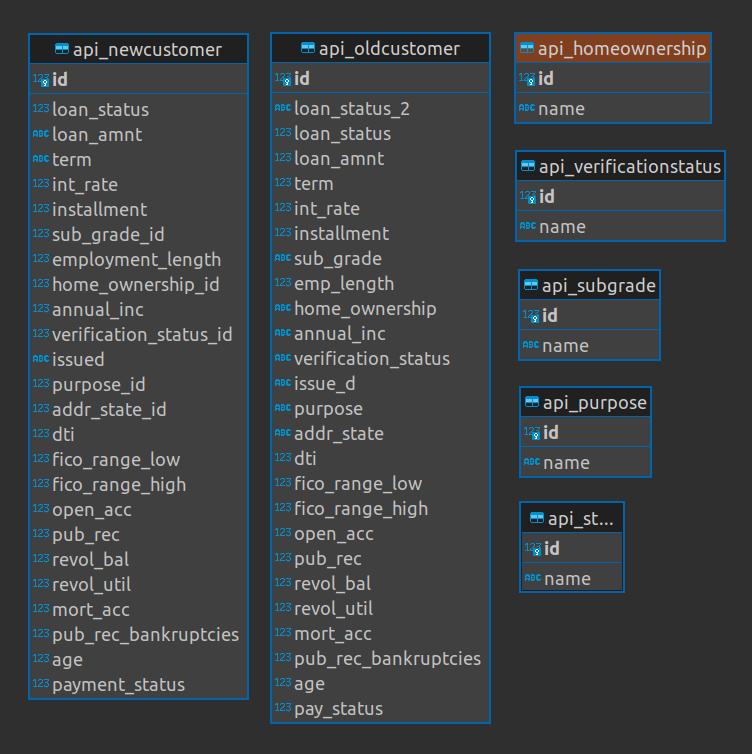

export GCP_PROJECT_ID=<your_gcp_project>
verify 
echo $GCP_PROJECT_ID
this will be used by dbts profiles.yml through Jinja templateing

# Asignment Description

## Obs: Mention Dbeaver, Valentina Studio

### Install DBT Packages
pip install dbt-sqlite
!There is an issue with the sqlite adapter for DBT, raised as https://github.com/codeforkjeff/dbt-sqlite/issues/47 where I also commented. You can edit the code in your virtual environment, like I did, to apply a bugfix. If you don't do this, you can't use the adapter, hence, you cannot even compile, much less run your models.

dbt deps

According to https://docs.getdbt.com/docs/core/connect-data-platform/sqlite-setup:
SQLite does not allow views in one schema (i.e. database file) to reference objects in another schema. You'll get this error from SQLite: "view [someview] cannot reference objects in database [somedatabase]". You must set materialized='table' in models that reference other schemas.

As such, we will materialize tables, not views. But in practice, for src, in a DWH like BQ, Redshift and Snowflake, I would use the views materialization.

### Source tables
I want to create some views of the raw tables as sources for my models (reason is so we can document them within DBT and able to use them in generating documentation DAG)

SELECT
    loan_status,
    loan_amnt,
    term,
    int_rate,
    installment,
    sub_grade,
    emp_length,
    home_ownership,
    is_mortgage,
    is_rent,
    is_own,
    is_any,
    is_other,
    annual_inc,
    verification_status,
    is_verified,
    is_not_verified,
    is_source_verified,
    issue_d,
    purpose,
    addr_state,
    dti,
    fico_range_low,
    fico_range_high,
    open_acc,
    pub_rec,
    revo_bal,
    revol_util,
    mort_acc,
    pub_rec_bankruptcies,
    age,
    pay_status

id integer (i would add it),
loan_status boolean (both fact tables, is integer in sqlite, chck not null, non-zero), # A charge-off means a debt is deemed unlikely to be collected by the creditor,
loan_amnt integer (in newcustomer is like 12.0k string, in oldcustomer is like integer 12,000), 
term integer (newcustomer is 3.0Y string, oldcustomer is integer already, check not null, consider meaning of zero),
int_rate double (here already some floating point number in both, check if not null or zero, thats odd),
installment double (looks fine in both, check non zero, not null),
sub_grade integer (you have sub_grade_id integer in newcustomer, and sub_grade in oldcustomer which is the code, we actually need the integer. Check that codes and numbers exist in the table, not null),
emp_length (employment_length in new, good in old, replace nulls with zero, check not null, above zero),
home_ownership integer (old customer has in string, new has in integer called home_ownership_id, check values in table),
is_mortgage boolean (I just want to say that including this in the credit risk model alongside the following features is redundant),
is_rent boolean (if mortgage == rent then true),
is_own,
is_any,
is_other,
annual_inc integer (aici la old customer tre sa spargem in doua numere, sa luam punctul de mijloc media si aia e, la nou lasam asa, check not null), 
verification_status integer (in old e string, in new e numar, same deal ca pana acum, are 3 valori max),
is_verified boolean (if source verified or verified => true else false),
is_not_verified boolean (same shit),
is_source_verified,
issue_d date (newcustomer called issued contains YYYY-mm, YYYY-mm-dd, dd-MON-YY, timestamps, etc,; oldcustomer called issue_d seems to contain only timestamps at 00:00:00, bring them to common format YYYY-mm-dd and check if string of date corresponds to this regex or see if yhere are datetime functions idk),
purpose inteer (new has purpose_id, old has name, check if integers are in ids, check if strings are in names in dim tables),
addr_state integer (same shit as above),
dti double (using dti in oldcustomer we can reverse engineer the annual income but nah, just check if between 0 and 100),
fico_range_low (low in both tables is 660 and high is 664, very interesting, they in reality go from 300 to 850),
fico_range_high (what can I replace the nulls with, I will replace it with the mean score),
open_acc integer (replace nulls with 0, must be positive),
pub_rec integer (replace nulls with 0, must be positive),
revol_bal (nulls replace with zero, should be positive),
revol_util (replace nulls with zero, should be between zero and 100),
mort_acc integer (should be positive, nulls replace with zero),
pub_rec_bankruptcies integer (should be positive, nulls replace with zero),
age integer (should be 18 to 120, doesnt contain nulls but check not null),
pay_status integer (-2 and -1 us oay duly; 1 is payment delay for 1mo, 2 is delay 2mo, up till 9)

### How to Run
cd credit-risk-score-modelling
dbt deps
declare environment variables
export GCP_PROJECT_ID=<your_project_id>
export DBT_SERVICE_ACCOUNT_KEYFILE=<your_service_account_keyfile_path>
dbt debug (to check connection)
